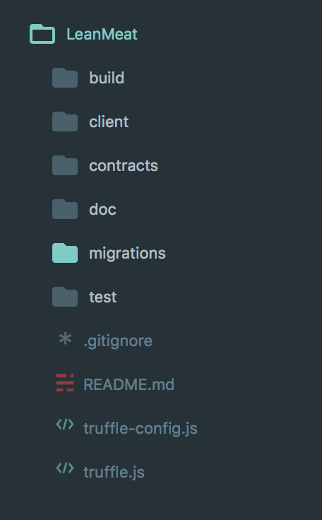
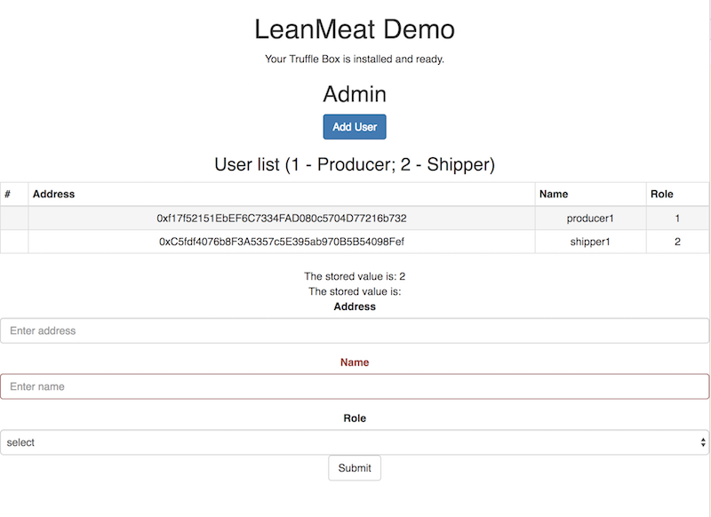
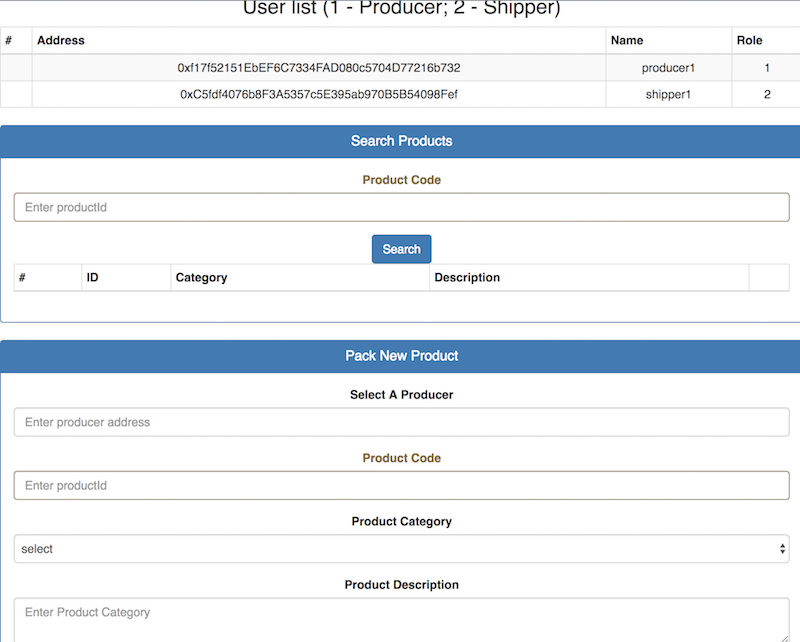
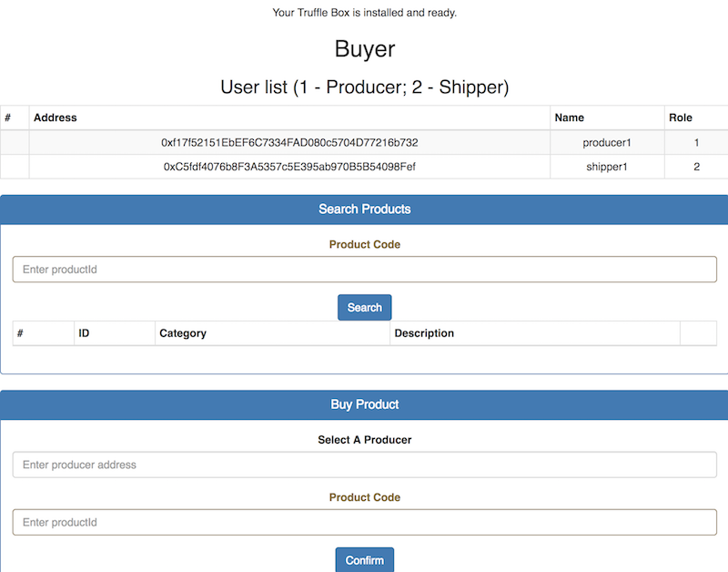
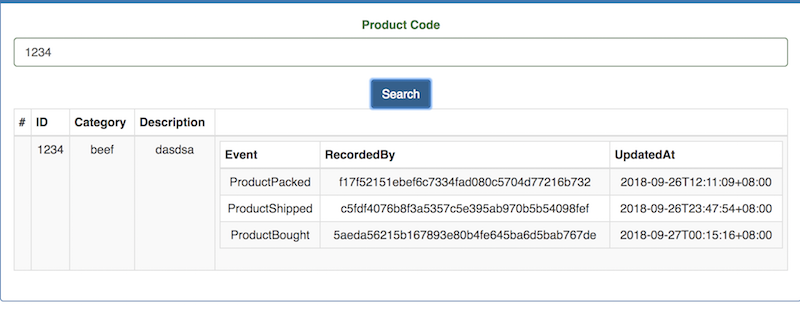

## Blockchain hackathon project - Lean Meat

### Background
Build a simple ethereum blockchain application to be able to track status of a product in its lifecycle from production to end consumer.

Project get inspired from [Truffle Webpack Demo](https://github.com/ConsenSys/truffle-webpack-demo)

There are one asset (Product) and 3 participants (Producer, Shipper and Consumer) in this project.

* When a Producer pack the product and ready for delivery, it will tag product with metadata such as id, category, description and when the product is packed by who. 
* When a Shipper ready for send delivery to consumer, it will add an entry to product saying when the product is delivered by who.
* When a consumer buy a product, the timestamp will also be updated on the product.
* All participants at any time can get detail information about given product, to make them confident that the product keep good quality standard all the way to end consumers.

**NOTE** We can add more action points for participants and more participants, but we make it simpler but yet good enough to demostrate problem we can solve.


### Coding Style

This repo uses ES6 Standard.

### Project structure



As shown above
- build       - compiled contract files
- client      - frontend project, built in nodejs
- contracts   - contract source codes
- doc         - document files
- migrations  - contract deploy files
- test        - test files
- truffle.js  - configuration for testnet, mainnet etc

### Running

For test smart contract, we can use copy .sol file and test directly in remix IDE, connect to local testnet provider.

The Web3 RPC location will be picked up from the `truffle.js` file.

1. Clone this repo
2. Start testnet
```
truffle develop
```
3. Under truffle console, compile and migrate contracts
```
compile

migrate
```
4. Make sure `testrpc` is running on its default port. Then:
  - `cd client && npm run start` - Starts the development server

### How to use

#### Admin

URL: http://127.0.0.1:3000/admin

- Admin can view all users
- Admin can add new users with roles




#### Producer

URL: http://127.0.0.1:3000/producer

- Search for product, track status of certain product.
- Pack a product



#### Buyer

URL: http://127.0.0.1:3000/buyer

- Search for product, track status of certain product.
- buy a product




An example of product detail is as follows:




### Next step

- Improve error handling
- Improve contract efficiency
- Unit tests